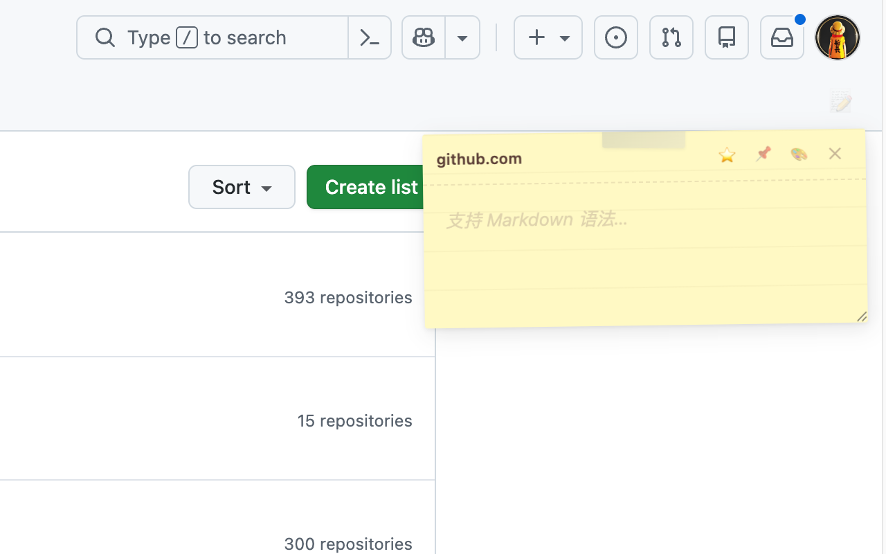

# iStar · 船仓网页便签

**在此网页上，随手记。**

iStar 是一个轻量级 Chrome 扩展，为你的每个网页提供专属的便利贴。随时记录灵感、待办事项或重要信息，数据本地加密存储，安全无忧。



## ✨ 核心功能

-   **📌 网页专属便签**：每个网页都有独立便签，内容互不干扰。
-   **📝 Markdown 支持**：支持标题、列表、代码块等 Markdown 语法渲染。
-   **🎨 8 款精美主题**：便利贴、牛皮纸、打字机、手账本、气泡、票券、剪报、毛玻璃支持。
-   **🔒 隐私加密**：AES-256-GCM 本地加密存储，绝不上传未授权服务器。
-   **☁️ 多端同步（可选）**：支持 Chrome Sync、GitHub Gist、Google Drive、飞书多维表格同步。
-   **🖱️ 右键收集**：选中文字右键即可快速保存到当前页便签。
-   **⌨️ 快捷键**：`Ctrl+Shift+M` (Mac: `⌘+Shift+M`) 快速开关。
-   **📋 全局管理**：侧边栏查看所有笔记，支持搜索和导出 Markdown。

## 🚀 安装使用

### 方式一：Chrome Web Store 安装
*(待上架后补充链接)*

### 方式二：加载解压扩展 (开发版)
1.  下载本项目代码或 Clone 仓库：
    ```bash
    git clone https://github.com/izscc/istar.git
    ```
2.  打开 Chrome 浏览器，访问 `chrome://extensions/`。
3.  开启右上角的 **"开发者模式"**。
4.  点击左上角 **"加载已解压的扩展程序"**。
5.  选择本项目文件夹即可。

## 🛠️ 开发指南

### 项目结构
```text
istar/
├── manifest.json       # 扩展配置文件 (MV3)
├── background.js       # 后台服务 Worker
├── content.js          # 网页注入脚本 (核心逻辑)
├── content.css         # 便签样式与主题
├── popup/              # 扩展弹窗 (设置与概览)
├── sidepanel/          # 侧边栏 (笔记管理)
├── lib/                # 工具库 (加密, Markdown, 同步)
├── icons/              # 图标资源
└── _locales/           # 国际化语言包
```

### 本地开发
修改代码后，需在 `chrome://extensions/` 页面点击刷新按钮重新加载扩展。

## ☁️ 同步配置说明

-   **Chrome Sync**: 默认开启，依赖浏览器登录的 Google 账号 (容量有限)。
-   **GitHub Gist**: 在设置中填入拥有 `gist` 权限的 Token。
-   **Google Drive**: 需在 Google Cloud Console 配置 OAuth Client ID (本项目已内置默认 ID)。
-   **飞书多维表格**: 需创建飞书自建应用，获取 App ID/Secret 及表格 ID。

## 📄 隐私政策
本项目不收集任何个人信息，所有数据默认存储在用户本地浏览器中。云同步功能仅在用户主动配置并授权后开启。
详细隐私政策请查阅 [privacy-policy.html](privacy-policy.html)。

## 🤝 贡献
欢迎提交 Issue 或 Pull Request 来改进 iStar！

## 📄 License
MIT License
